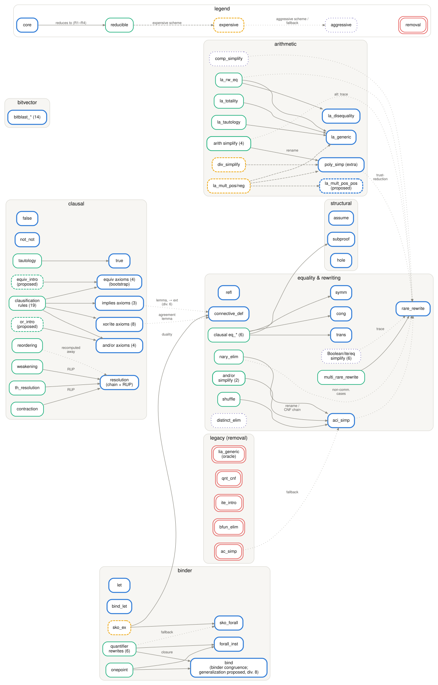

# Reduction graph

The current state of the classification as a graph: nodes are rules (families collapsed, with
counts), grouped by concern category; an edge points from a rule to the rules its reduction
targets. Border color and style encode the reducibility level — **core** (blue, bold),
**reducible** (green), **expensive** (yellow, dashed), **aggressive** (violet, dotted),
**removal** (red, double border) — and proposals (`la_mult_pos_pos`, `equiv_intro`, `or_intro`;
the `bind` generalization is noted on the `bind` node) are marked by a dashed border or a
"(proposed)" note. Edge styles mirror the levels: solid = a reduction meeting R1–R4, dashed = an
expensive scheme, dotted = an aggressive scheme or a fallback route.

Ubiquitous glue targets are omitted to keep the graph readable: nearly every reduction also uses
`resolution`, `subproof`, and iff-introduction (`equiv_intro`, or its `equiv_neg1/2` derivation),
so those edges are drawn only where they are the distinctive target.

The source is [`reduction-graph.dot`](./reduction-graph.dot); regenerate with
`dot -Tsvg reduction-graph.dot -o reduction-graph.svg`.
